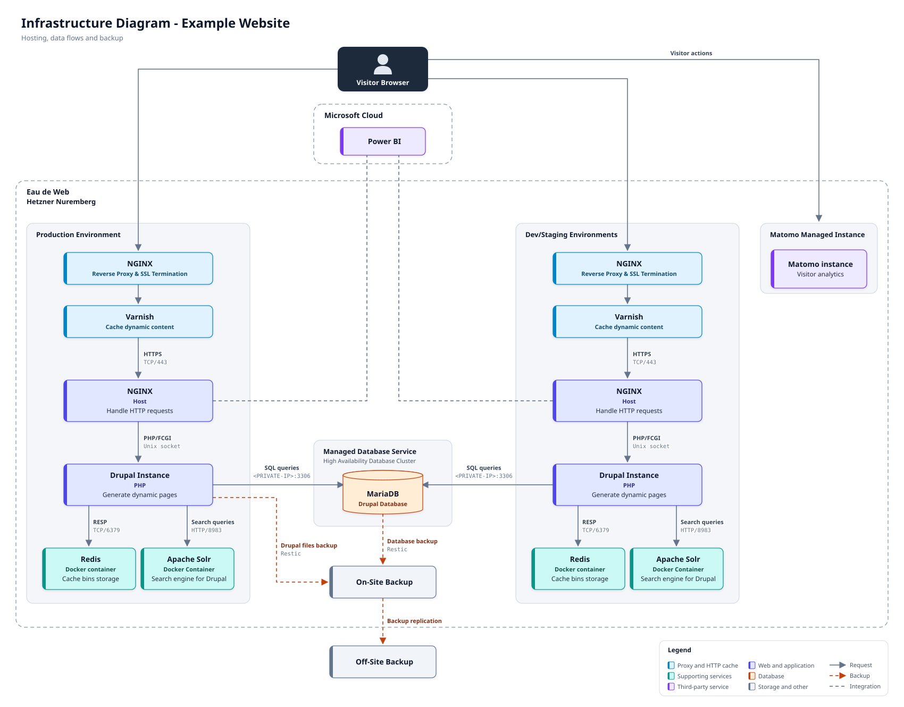

# Eau de Web - Claude Code plugin for Drupal

Shared skills, agents and commands for the Eau de Web Drupal team. The repository is both a Claude Code plugin (`edw-drupal`) and a plugin marketplace (`edw`), so it installs with two commands.

## Installation

```
/plugin marketplace add <git-url-of-this-repository>
/plugin install edw-drupal@edw
```

Update to the latest version:

```
/plugin marketplace update edw
```

## What is included

| Type | Name | Purpose |
|---|---|---|
| Skill | `drupal-bundle-spec` | Specifications for content types, vocabularies, paragraph, block and media types (settings, field table, edit form) |
| Skill | `edw-diagram` | Architecture and infrastructure diagrams as SVG and PNG in the Eau de Web style, laid out by hand through a small Python library |

Skills load automatically when the task matches their description. They can also be called directly, e.g. `/edw-drupal:drupal-bundle-spec`.

### Example: `edw-diagram`

Diagrams are laid out by hand through a small Python library, with a fixed palette (WCAG AA) and automatic checks for contrast, text overflow and overlaps. The diagram below is generated by [`skills/edw-diagram/assets/example_infrastructure.py`](skills/edw-diagram/assets/example_infrastructure.py):



To regenerate it:

```
python3 skills/edw-diagram/assets/example_infrastructure.py skills/edw-diagram/assets/example.svg
```

## Structure

```
.claude-plugin/
  plugin.json          Plugin manifest
  marketplace.json     Marketplace manifest (points to this repository)
skills/<name>/SKILL.md Skills - knowledge and procedures loaded on demand
agents/<name>.md       Subagents with their own prompt and tools (optional)
commands/<name>.md     Slash commands (optional)
```

## Contributing

1. Create a branch.
2. Add or edit a skill in `skills/<name>/SKILL.md`. The `description` in the frontmatter decides when Claude loads the skill, so state clearly what it does and when to use it.
3. Keep `SKILL.md` short. Move long reference material (checklists, examples, API notes) to `skills/<name>/references/` and link to it.
4. Test locally: `claude --plugin-dir .` and give Claude a task that should trigger the skill.
5. Bump `version` in `.claude-plugin/plugin.json` and open a merge request.

Do not add credentials, customer data or project-specific secrets. Everything in this repository is shared with the whole team.
